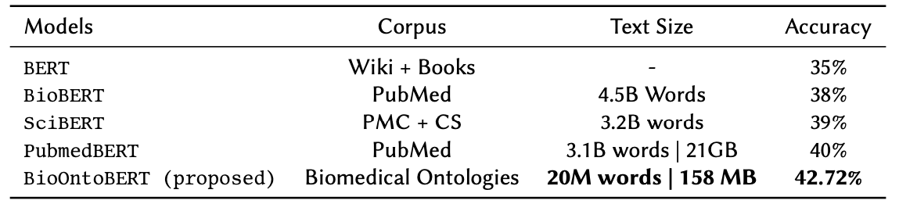

# 🤖 BioOntoBERT 🤖 Combining BERT with Biomedical Ontologies 

📝 [Read the Full Paper](https://ceur-ws.org/Vol-3603/Paper9.pdf) 📝 

This repository provides the code and instructions for pre-training the **BioOntoBERT** model, which integrates BERT with knowledge from biomedical ontologies. The model is pre-trained using a corpus generated by Onto2Sen from biomedical ontologies and then fine-tuned on the **MedMCQA** dataset. BioOntoBERT demonstrates enhanced performance over baseline BERT models, including **PubMedBERT**, in biomedical multiple-choice question-answering tasks. Remarkably, it achieves this with only 0.7% of the pre-training data used for PubMedBERT, showcasing its efficiency and improved accuracy.

--------- 
## Contents

- [Introduction](#introduction)
- [Setup-Environment](#Setup-Environment)
- [Pre-training](#pre-training)
- [Fine-tuning](#fine-tuning)
- [Results](#results)

## Introduction

BioOntoBERT is a domain specific language model tailored for the biomedical domain. It is pre-trained on a large corpus generated from biomedical ontologies using the Onto2Sen methodology, which helps capture domain-specific context and semantics. This pre-trained model is then fine-tuned on the MedMCQA dataset, a benchmark for biomedical question answering, to improve its performance on this specific task.

## Setup-Environment

Install the required packages using:

```bash
pip install -r requirements.txt
```

## Pre-training
- Data Preparation: Prepare the Onto2Sen-generated biomedical corpus in text format for pre-training.

- Model Configuration: Modify the pre-training configuration in pretrain_config.json to set hyperparameters, paths, and other settings.

- Run Pre-training: Execute the pre-training script


## Finetuning
- Data Preparation: Obtain the MedMCQA dataset and preprocess it for fine-tuning.

- Model Configuration: Adjust the fine-tuning configuration in finetune_config.json according to your hardware and preferences.

- Run Fine-tuning: Start fine-tuning the pre-trained BioOntoBERT model


## Results



The above table shows how efficiently BioOntoBERT is outperforming other pre-training BERT models with just 158MB of pre-training data from Biomedical ontologies.
